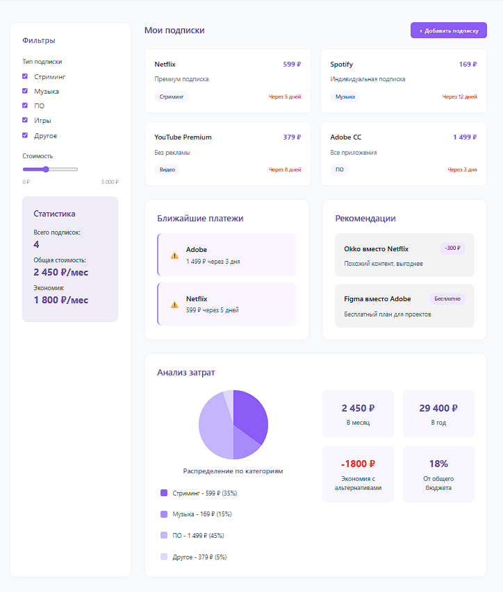

# Курсовая работа. Верстка сайта.
 
### Тема курсовой: Менеджер подписок и сервисов (список подписок, напоминания о платежах, анализ затрат, рекомендации альтернатив, фильтры по типу/стоимости)

### Верстка сайта и макет в Figma были загружены на GitHub своевременно, но они находились в репозитории rpi_homework.io на ветке Course_work. Теперь я добавила их сюда и объединила все в одном репозитории вместе с реализацией курсовой работы.

### 1. Ссылка на макет в Figma:
### https://www.figma.com/design/hfnbplqregxWUFHVLnoGpR/Untitled?node-id=243-14&t=XZaaK6ppOHDauRtS-0

### 2. Сайт:
